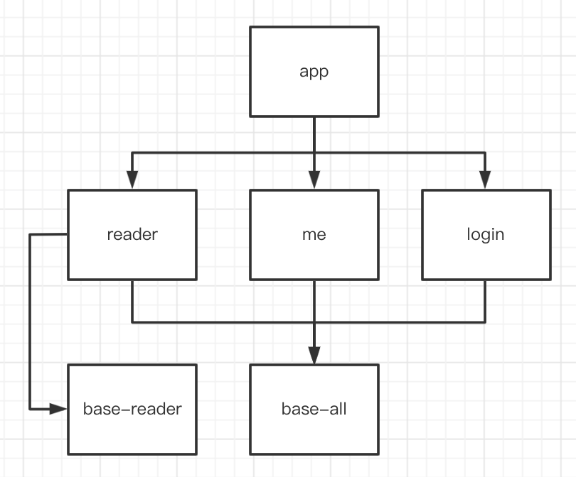
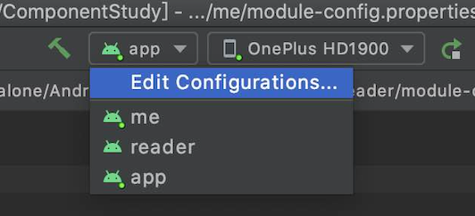
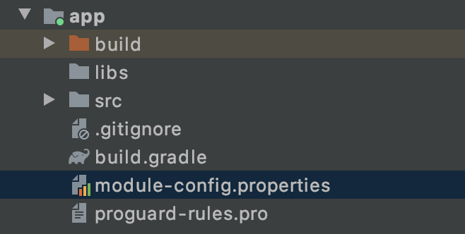
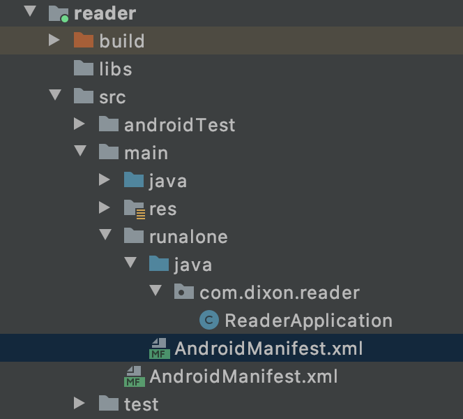

# 组件化框架 ComponentLight

> 以下内容针对想要实现工程组件化开发的中小型项目

本文将通过以下问题，逐步说明 `ComponentLight` 的用途和用法。

1. 为什么要用组件化框架
2. `ComponentLight` 能做什么
3. `ComponentLight` 怎么用

## 一、为什么要用组件化框架

为什么要用组件化框架来实现项目组件化，传统组件化方式有什么问题吗？

通过创建 module、手动设置依赖的组件化方式可以实现业务功能组件化，但是效果不好，实际开发中有暗病。

### 传统组件化结构的问题

在说问题之前，我们先来看下常见的传统组件化结构。



**项目分析**

假如有这么一个项目（如上图），它的 app 模块是程序入口，有阅读（reader）、我的（me）、登录（login）三个业务模块，以及 base-all、base-reader 俩个基础模块。

为了方便说明，我把 app、reader、me、login 等业务（功能）模块称为组件，base-all、base-reader 称为基础库。

上面的项目，组件之间互不依赖，开发时不能直接引用，安全无耦合。同时基础库被组件依赖，组件之间可以依赖基础库做信息传递。

回顾下 Android 组件化。组件化是为了实现业务隔离开发，消除耦合的同时提升开发效率，为此要达到以下效果：

1. 功能组件化。功能之间独立，开发时不能直接相互引用。这样有利于负责人独立开发自己的组件，至少拉代码时不用担心冲突、删组件时不用担心耦合。
2. 组件独立化。各组件能作为 app 独立运行，不仅调试起来边界清晰，而且提升了编译速度。即，组件能随时从主项目插拔。

上面的项目中，reader、me、login 相互独立，表现在开发时，不能直接依赖；打包时，由于都被 app 依赖，所以可以全部打包到 apk 里。看似实现了组件化，但是实际操作起来却有很多不方便的地方：

首先，在组件独立化上，每次切换独立运行，要先修改 build.gradle 为 com.android.application、添加 android.sources，然后指定入口 Activity、移除主工程对它的依赖、Rebuild，一大堆操作后才能运行。操作繁琐复杂且耗时，本来组件独立化是为了方便调试、增快编译速度，怎么像是赔了夫人又折兵？

再者，有类似这样的场景：me 组件意为"我的"，它展示的是用户的数据，既然涉及用户数据，必然离不开 login 组件。也就是说，me 如果独立运行，需要把 login 打包在内。那怎么做呢？让 me 组件直接依赖 login？此时 me 都可以直接引用 login 的代码，业务功能何来独立？那打包时再手动添加 login 依赖？你确定组件化不是自找麻烦。好，那再创建一个类似 app 的壳模块，让它包含 me 和 login，然后将壳模块独立启动，总可以了吧。确实可以，但是随着项目日益扩大，壳模块也会日渐增多，冗余的壳模块导致整个项目非常乱。

**问题总结**

分析了这么半天，核心问题就俩个：

1. 独立运行可行性低，复杂的流程让人望而却步。
2. 通过壳来实现 "**开发时组件无依赖、独立运行时又能把必要的组件打包进去**" 的方式很不灵活。

## 二、ComponentLight 能做什么

既然知道了上述问题，那 `ComponentLight` 自然就是为解决这俩个问题而生。

首先看下使用了 `ComponentLight` 后，各组件如何独立运行：



直接在上栏中切换-运行即可。

然后看下组件 me 如何在不依赖壳模块的情况下，开发时不依赖 login（不可直接引用 login 代码，组件独立）、而在独立运行时自动打包进必要组件 login。只需要在 me 模块的相应配置文件（module-config.properties）里如下声明：

```java
depend_component=login
```

利用组件化框架可以极大的简化组件化过程中繁琐复杂的流程，最大程度的关注业务开发。

## 三、ComponentLight 怎么用

### 1、引入依赖

在项目根 build.gradle 中添加代码

```java
buildscript {
    ...
    dependencies {
        ...
        classpath('com.dixon.plugin:component_light:1.0.0')
    }
}
```

### 2、配置模块

#### 2.1、应用插件

找到各个 `module` 的 `build.gradle` 文件，移除 `apply plugin: 'com.android.application'` 或 `apply plugin: 'com.android.library'`，用 `apply plugin: 'com.dixon.component'` 替代。


```java
apply plugin: 'com.dixon.component'

android {
    compileSdkVersion xx

    defaultConfig {
        minSdkVersion xx
        ...
```

> 对于基础库可以不使用 `ComponentLight`，但推荐使用，以表明基础库在组件化项目中的层级关系。

#### 2.2、声明模块关系

在各个 `module` 目录下均新建 `module-config.properties` 文件，用来声明模块关系。

位置如下图：





该文件的内容如下示例：

```java
module_type=application
depend_component=login,me,reader
depend_base=baseall
```

下面说明声明的意义和用法。

**① module_type**

表明当前模块的类型，这个属性最终将结合打包环境决定当前模块是 `com.android.application` 还是 `com.android.library`。它的参数如下：

参数|意义
---|---
application|表明当前模块是工程主模块。对应到上述项目中就是 app，不需要配置 runalone 即可独立运行，关于 runalone 配置后面会说。
component|表明当前模块是组件。该组件可独立运行，但要配置 runalone。
library|表明当前模块是组件。该组件不可独立运行，不需要配置 runalone。
base|表明当前模块是基础库。该基础库不可独立运行，不需要配置 runalone。

> 其实 library 和 base 本质上没有区别，但是意义上是有分别的。
> library 表示的是业务组件，和 component 同级，不能独立运行可能是因为没有必要。
> base 则是基础库。

综上，`module_type` 决定了当前模块是否可独立运行，和组件间的开发可见性没有关系。

**② depend_component**

当前组件 **独立运行时** 需要依赖的其它组件。

`depend_component` 参数声明了当前模块在业务意义上需要依赖的其它同级组件，并且当前模块独立运行时，这些依赖会被正确打包进 apk。被 `depend_component` 配置的组件在开发时并不会产生依赖，也就是说，它用于解决传统组件化依赖壳的问题。举几个例子：

```java
模块 me 配置 depend_component=login
则 me 在开发时，无法直接引用 login 的代码。
但 me 在独立运行时，会将 login 正确打包进来，不再需要手动配置或依赖壳。
```

```java
模块 app 配置 depend_component=me
模块 me 配置 depend_component=login
将 app 作为主工程打包，则 me 跳转 login 会【失败】
depend_component 决定了当前组件依赖的其它组件，如果要从 app 跳转至 login，不管是直接的还是间接的，app 都必须声明需要组件 login。
```

**③ depend_base**

表明当前模块依赖的基础库。

被 `depend_base` 声明的基础库，会被当前模块在任何时候依赖。也就是说不仅开发时能直接引用，运行时也会一并打包。

不同于 `depend_component`，假如组件 A 依赖组件 B，组件 B 依赖基础库 b，则 A 组件开发时虽然不能直接引用基础库 b 的代码，但在运行时会将基础库 b 正确打包进来。这是因为基础库 b 是组件 B 运行的基础，理论上是组件 B 的一部分，组件 B 缺少基础库 b 将无法运行，所以即使 A 的 `depend_base` 没有声明 b，b 也将正常打包进 apk。

上面三个参数分别声明了模块类型、组件关系、基础库关系，理论上就声明完了。

但是要某组件独立运行，除声明 `module_type=component` 外，还需要在 **该组件模块下** 配置 `runalone`。

#### 2.3、配置 runalone

在 `module/src/main` 下新建 `runalone` 文件夹，将 `AndroidManifest.xml` 拷贝一份至 `runalone` 文件夹下，并指定启动 `activity`。

这里我是这么配置的：




runalone 中的代码仅会在组件独立运行时用到，不会打包进主工程或其它独立组件中。

关于 runalone，开发者可以按需自行定制，但至少要满足最小独立启动要求：

1.runalone 中有 AndroidManifest.xml；
2.AndroidManifest.xml 配置了 package；
3.AndroidManifest.xml 配置了默认 Activity。

> 可能会出的问题：
> 1.AndroidManifest 文件记得检查是否配置了 package。（有的会自带，没有包名怎么启动～）
> 2.明明配置了启动 Activity，却报 default activity 不存在，重启即可。
> 3.如果独立运行后，启动闪退，可能是因为你的资源文件找不到。尝试将资源放在 base 模块下。
> 4.独立运行后，如果新增四大组件，系统会自行声明到 runalone-AndroidManifest.xml 中，记得手动同步至原 AndroidManiest.xml，以保证主工程正确运行。

配置完毕后，`Rebuild` 即可。

附 runalone 的文件位置：

```java
manifest.srcFile "src/main/runalone/AndroidManifest.xml"
java.srcDir "src/main/runalone/java"
res.srcDir "src/main/runalone/res"
assets.srcDir "src/main/runalone/assets"
jniLibs.srcDir '../app/src/main/jniLibs'
```

## 四、尾声

bug 和建议可以直接反馈至 github 或文章下边。本人能力有限，错误在所难免，见谅。

[Demo Github](https://github.com/zhxyComing/ComponentLightDemo)
[插件源码 Github](https://github.com/zhxyComing/ComponentLight)

[TOC]

